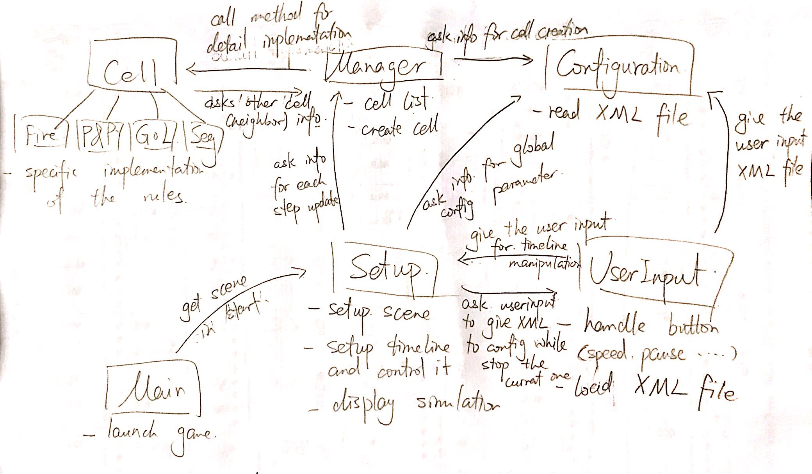

# DESIGN

## Introduction

The overall problem our team is trying to solve is writing a program that can read in and simulate a CA model. One of our primary design goals is to design different types of cells under an inheritance hierarchy. Each type of cell will have a different implementation corresponding to CA simulation rules. New type of cells could be added easily according to new rules, which demonstrates the flexibility of the project. The cells will be placed in a grid, and each cell will be given a list of its neighbors from the cell manager. The cell state information is held by each cell and can only be accessed by the cell manager and other cells. The cell manager oversees the behavior of each individual cell and asks the cell to update in every step. We plan to update each cell without affecting the updates of the neighboring cells by storing the cell’s update information in a private field. After each cell obtains its update information, we will execute the update. The simulation parameters and initial cell states will be read in from a file.

## Overview

As noted in the introduction, cells will be created under an inheritance hierarchy. The cell superclass will have subclasses corresponding to the four different types of CA simulations. Each cell will have its own state and behavior and has a status return method accessible to the manager class. For example, the Spreading of Fire simulation will use utilize one cell subclass. The subclass will have a method that returns the cell status (i.e. 0, 1, or 2 for empty, tree, or burning, respectively). Different behavior methods would be created in each cell subclass according to the rules of each CA simulation. Whenever the manager calls the cells class for update, the cell would get the neighbor list, store update information and wait for execution command. 

The cell manager class would keep track of all the cells created in a cell list. It would have a method that accepts a cell as input parameter, finds neighbors of that cell and returns a list of neighbor cells. This would help individual cells to determine the state of their neighbor cells and behave accordingly. The manager can also create cells according to information gained from configuration class. The manager will also be able to ask each cell to store its update information and execute the update when requested by the setup class. 

The main class will extends Application and launch the program in `launch()`. It will also initialize the stage in `start()` by calling methods in setup class. 

The setup class initializes the scene and controls the timeline in separate methods. It also calls the manager to update the cell in each step. The setup class will need to work with the user input class to control the timeline: pause, resume or change the animation speed. It will stop the simulation and ask the user input class to pass the file to configuration class when a new file is loaded. At the same time, it would ask the manager to request information from configuration class for cell creation. The setup class will also ask configuration class for information about global configuration parameter such as column/row number and simulation speed. 

The user input class will handle all the buttons on the user interface. It will pass the input information, especially those about the timeline, to setup class for timeline control. It will also pass the file to configuration class for further parsing when a new XML file is loaded. 

The configuration class will read and parse the XML file from the user input class. It will store all the information in its private fields and pass it to manager and setup classes through different methods. 

## User Interface

## Design Details

## Design Consideration

## Team Responsibilities

The basic implementation of cell society contains three parts, simulation, configuration and visualization. Estelle is responsible for simulation, David is responsible for configuration while Ryan is responsible for visualization. Since there is not a clear cut for these three parts when implementing all the classes, and since there is a lot of dependency and collaboration between different classes, team members may make some changes in someone else’s class. 

In terms of the implementation process of the project, all team members would understand the structure of the program and relationship between different classes. Empty methods would be written first to ensure that when another class is trying to called certain method, it would exists. This also speeds up the coding process since no one needs to wait for others to finish the method their code depends on. 

