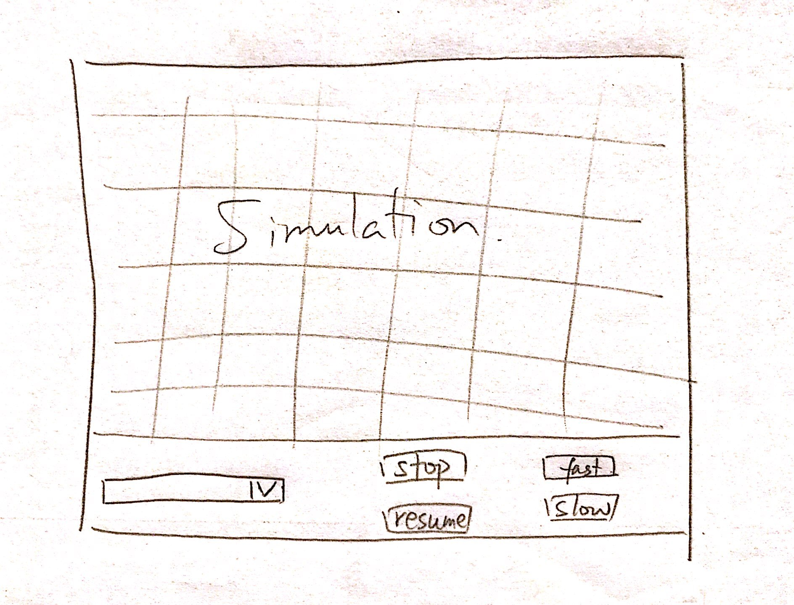

# DESIGN

## Introduction

The overall problem our team is trying to solve is writing a program that can read in and simulate a CA model. One of our primary design goals is to design different types of cells under an inheritance hierarchy. Each type of cell will have a different implementation corresponding to CA simulation rules. New type of cells could be added easily according to new rules, which demonstrates the flexibility of the project. The cells will be placed in a grid, and each cell will be given a list of its neighbors from the cell manager. The cell state information is held by each cell and can only be accessed by the cell manager and other cells. The cell manager oversees the behavior of each individual cell and asks the cell to update in every step. We plan to update each cell without affecting the updates of the neighboring cells by storing the cell’s update information in a private field. After each cell obtains its update information, we will execute the update. The simulation parameters and initial cell states will be read in from a file.

## Overview

As noted in the introduction, cells will be created under an inheritance hierarchy. The **cell superclass** will have subclasses corresponding to the four different types of CA simulations. Each cell will have its own state and behavior and has a status return method accessible to the manager class. For example, the Spreading of Fire simulation will use utilize one cell subclass. The subclass will have a method that returns the cell status (i.e. 0, 1, or 2 for empty, tree, or burning, respectively). Different behavior methods would be created in each cell subclass according to the rules of each CA simulation. Whenever the manager calls the cells class for update, the cell would get the neighbor list, store update information and wait for execution command. 

The **cell manager class** would keep track of all the cells created in a cell list. It would have a method that accepts a cell as input parameter, finds neighbors of that cell and returns a list of neighbor cells. This would help individual cells to determine the state of their neighbor cells and behave accordingly. The manager can also create cells according to information gained from configuration class. The manager will also be able to ask each cell to store its update information and execute the update when requested by the setup class. 

The **main class** will extends Application and launch the program in `launch()`. It will also initialize the stage in `start()` by calling methods in setup class. 

The **setup class** initializes the scene and controls the timeline in separate methods. It also calls the manager to update the cell in each step. The setup class will need to work with the user input class to control the timeline: pause, resume or change the animation speed. It will stop the simulation and ask the user input class to pass the file to configuration class when a new file is loaded. At the same time, it would ask the manager to request information from configuration class for cell creation. The setup class will also ask configuration class for information about global configuration parameter such as column/row number and simulation speed. 

The **user input class** will handle all the buttons on the user interface. It will pass the input information, especially those about the timeline, to setup class for timeline control. It will also pass the file to configuration class for further parsing when a new XML file is loaded. 

The **configuration class** will read and parse the XML file from the user input class. It will store all the information in its private fields and pass it to manager and setup classes through different methods. 

## User Interface

The user interface consist of a JavaFX Stage and scene. The scene would contain GridPane with several nodes: a scrollpane allowing the user to choose an XML file from the resource folder, buttons to start and stop the simulation, buttons to change the speed of the animation, a grid of NxM cells (eac extending the rectangle class) where N rows and M columns are specified in the XML file. The grid will be located above the buttons. After the basic implementation phase, we may add a Slider for the user to determine the size of the grid (assuming a square). 

For erroneous situations, such as bad input data while parsing, a try and catch statement will be used in the parsing method. Error message would be displayed on a new window. 

## Design Details

The main class will be used to start the program by creating an instance of the setup class. The setup class will be an extension of the Java Application class where `start()` will create an instance of a simulation step/loop class. The scene will be initialized in `start()` as well by calling a method onto the simulation loop class that initializes the user interface. Lastly in `start()`, the simulation loop class will also have start method that will be called, creating a timeline and entering a loop of updating the grid based on configuration parameters. 

Once the program enters the simulation loop, the program will ask the user for input. The user will be allows to choose an xml file from the project resource folder. The xml will be parsed for initialization parameters and the grid will be filled in with the initial cell states. In each xml file, the name of the simulation will be read and the grid will be filled in with cells of the appropriate subclass. The xml file will define the colors of the states and the initial states in the grid. 

The grid will be a GridPane object and will have a constant width and height. The cell width/height will change according to the number or rows and columns defined in the xml or from a `Slider`, possibly. The cells will mostly likely be extensions of the Rectangle class since rectangles have width/height/location getters and setters. In each loop, all cells will have their next state calculated and the tiles will update to the new color based on the new state of the cell. These colors will be defined the xml and will be read into a Map object. The cell superclass will have a method that will return the color of the cell based on its current/next state.

**Use case: Apply the rules to a middle cell: set the next state of a cell to dead by counting its number of neighbors using the Game of Life rules for a cell in the middle (i.e., with all its neighbors).**

The manager class will give the cell a list of neighboring cells. For a middle cell (i.e. the cell’s neighbors’ x and y coordinates are within the grid coordinates), the manager will add those neighbors into a list of cell objects. For a cell to be dead in the next state, either it has fewer than two live neighbors or has more than three live neighbors. The cell will determine its next state based on these rules and the current states of its neighbors by iterating through the list and counting the number of living neighbors. 

**Use case: Apply the rules to an edge cell: set the next state of a cell to live by counting its number of neighbors using the Game of Life rules for a cell on the edge (i.e., with some of its neighbors missing).**

For an edge cell, it will have an index that equal 0, or the total number of rows or the total number of columns in the grid. Thus, if either of these are true, then based on the index that is at the limit, the manager class will add the neighbors (increment up/down a row/col) to a list. The cell will iterate through the list and if it has two or three live neighbors, the next state will be live (regardless of the current state in this example).

**Use case: Move to the next generation: update all cells in a simulation from their current state to their next state and display the result graphically**

Once all cells know their next states, the program will iterate through the 2x2 array of cells (created from the xml file containing a grid of initial states) and the cells will set their current state equal to their next state. The cells will set their own colors using a cell method that returns the appropriate color based on the cell state (via a Map).

**Use case: Set a simulation parameter: set the value of a parameter, probCatch, for a simulation, Fire, based on the value given in an XML file.**

The input XML file will be parsed to read in a value for probCatch for the Fire simulation in the configuration class. Each cell will have a constant double value of probCatch (within [0,1] inclusive). If a burning cell has a tree neighbor, a random double within [0,1] (inclusive) will be generated. If this value is less than the value of probCatch, the tree neighbor’s next state will be burning. A random double will be generated for every tree neighbor of a burning cell.

**Use case: switch simulations: use the GUI to change the current simulation from Game of Life to Wator**

The simulation loop class will initialize the scene and add buttons that enable to play, stop, and reset the simulation. Another button will allow the user to locate an XML file from the resource folder and submit it to be parsed. Throughout the simulation, the button can be pressed and the MouseEvent will be handled to stop the simulation (set a boolean variable to `false`). A window will open allowing the user to located the file within the resource folder and submit it. Then, the XML file will be parsed and a new GridPane will be created, along with buttons and the initialized cells from the XML parameters. The scene will be added to the stage and the boolean variable that allows the simulation to run will be set to `true`. Cells will then be updated on each frame.

## Design Consideration

One big assumption we made for our design is that different simulation and different rules would result in similar basic cell properties. So when the cell manager class wants create cells, move cells or update cells, it will only need to call the methods of cell superclass, which are shared between different cell subclass for different simulations. Even though the detail implementation would be different, cell subclasses would have methods that share the same name. 

We also make an important decision on the update process for each cell. In order to update individual cells without affecting the updates on their neighbor cells, we will have each cell store their update information first. When all cells have their update information, we will then execute the update on every cells. Even though this would slow down the program by running through the cell list twice, it ensures that all cells are updated on the same rate and basing on the current state of the simulation. 

We choose to let each cell make decision about its own state during update and execute the update in their own methods. This means that we might need to pass some additional parameters to the cell constructor to ensure that the cell class would have the permission to implement the changes. The reason for the cell to make decision and execute update is that other class won’t need to request information from cell, make the decision, implement and change the cell state. Since cell class knows all the information needed, it will just need to make the decision and implement, saving two extra steps. 

## Team Responsibilities 

The basic implementation of cell society contains three parts, **simulation**, **configuration** and **visualization**. Estelle is responsible for simulation, David is responsible for configuration while Ryan is responsible for visualization. Since there is not a clear cut for these three parts when implementing all the classes, and since there is a lot of dependency and collaboration between different classes, team members may make some changes in someone else’s class. 

In terms of the implementation process of the project, all team members would understand the structure of the program and relationship between different classes. Empty methods would be written first to ensure that when another class is trying to called certain method, it would exists. This also speeds up the coding process since no one needs to wait for others to finish the method their code depends on. 

test

